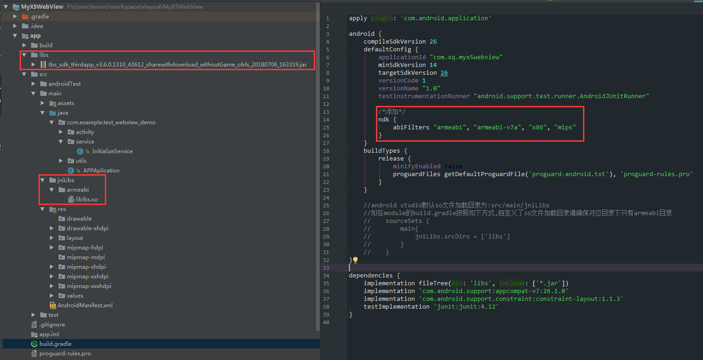

参考：

[sdk下载](https://x5.tencent.com/tbs/sdk.html)

[接入文档](https://x5.tencent.com/tbs/guide/sdkInit.html)

[64位手机无法加载x5(libmttwebview.so is 32-bit instead of 64-bit)](https://x5.tencent.com/tbs/technical.html#/detail/sdk/1/34cf1488-7dc2-41ca-a77f-0014112bcab7)

[SDK接入问题](https://x5.tencent.com/tbs/technical.html#/sdk)

[推荐阅读X5WebViewDemo](https://github.com/EUEHBin/X5WebViewDemo)

[Android 抛弃原生WebView，使用腾讯X5内核、并加入广告拦截。](https://blog.csdn.net/qq_35070105/article/details/80047595)

# TBS(腾讯浏览服务)的优势 #

1) 速度快：相比系统webview的网页打开速度有30+%的提升；

2) 省流量：使用云端优化技术使流量节省20+%；

3) 更安全：安全问题可以在24小时内修复；

4) 更稳定：经过亿级用户的使用考验，CRASH率低于0.15%；

5) 兼容好：无系统内核的碎片化问题，更少的兼容性问题；

6) 体验优：支持夜间模式、适屏排版、字体设置等浏览增强功能；

7) 功能全：在Html5、ES6上有更完整支持；

8) 更强大：集成强大的视频播放器，支持视频格式远多于系统webview；

9) 视频和文件格式的支持x5内核多于系统内核

10) 防劫持是x5内核的一大亮点

# 运行环境 #

1)手机ROM版本高于或等于2.2版本

2)手机RAM大于500M，该RAM值通过手机 /proc/meminfo 文件的MemTotal动态获取

注：如果不满足上述条件，SDK会自动切换到系统WebView，SDK使用者不用关心该切换过程。

# SDK尺寸指标 #

1)SDK提供的JAR包约250K

# 权限
    <uses-permission android:name="android.permission.WRITE_EXTERNAL_STORAGE" />

	<uses-permission android:name="android.permission.ACCESS_NETWORK_STATE" />

	<uses-permission android:name="android.permission.ACCESS_WIFI_STATE" />

	<uses-permission android:name="android.permission.INTERNET" />

	<uses-permission android:name="android.permission.READ_PHONE_STATE" />

# lib包 和 so文件 配置

# 初始化

	public class MyApp extends Application {

	    @Override
	    public void onCreate() {
	        super.onCreate();
	        //初始化 x5内核
	        new Thread(new Runnable() {
	            @Override
	            public void run() {
	                QbSdk.PreInitCallback cb = new QbSdk.PreInitCallback() {

			            @Override
			            public void onViewInitFinished(boolean arg0) {
			                //x5內核初始化完成的回调，为true表示x5内核加载成功，
							//否则表示x5内核加载失败，会自动切换到系统内核。
			                Log.d("app", " onViewInitFinished is " + arg0);
			            }

			            @Override
			            public void onCoreInitFinished() {
			            }
			        };
			        //x5内核初始化接口
			        QbSdk.initX5Environment(getApplicationContext(), cb);
	            }
	        }).start();
	    }
	}

